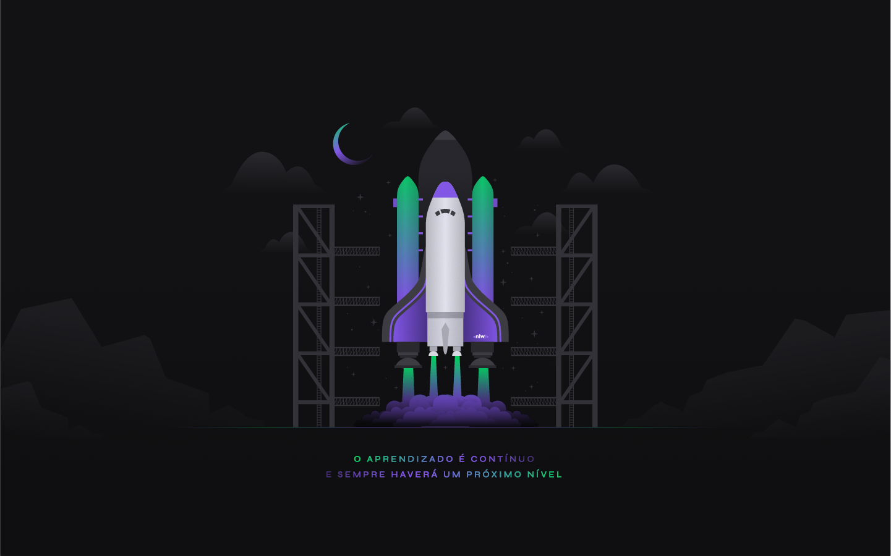

<h1 align="center">NLW#04 - Moveit</h1> 

### :mag: Sobre o projeto

A aplicação consiste na técnica de pomodoro. Um contador de 25 minutos que deve ser utilizado para manter foco em sua tarefa, seja estudar, trabalhar e um intervalo de 5 minutos para você fazer alguma tarefa. Conforme completar as tarefas, ganha pontos de experiência vai subindo de nível. Essas atividades foram pensadas para as pessoas que passam muito tempo trabalhando em frente aos computadores. Servem para exercitar-se e relaxar já que ficar muito tempo sentado pode ocasionar diversos problemas futuros. 

### 💻 Diário de Bordo 
**Aula** | **Conteúdo**
------------ | -------------
Aula 01 - 22 fev | Foi criado um projeto inicial e sua descrição esta neste repositório: https://github.com/raissaboeng/nlw4-react-moveit-aula01
Aula 02 - 23 fev | <li> Next: Biblioteca de construção de interfaces. Substitui o create-react-app. Permite criar uma aplicação com todos os tipos SPA, SSR e SSG. Foi criado para que as aplicações fossem indexadas para os motores de busca. No fluxo da API fica em uma camada intermediária entre o backend e o frontend. Responsável por construir a interface da aplicação por um servidor intermediário deixando pronto pro usuário quando o mesmo acessar. </li> <li>SPA ou Single Page Aplication: uma única página que usando as rotas altera apenas seu conteúdo e não a página como um todo (create-react-app só faz SPA). Neste modelo o SEO para pesquisa não funciona já que os motores de buscam não aguardam a interface ser construída no frontend ou não acionam o javascript. </li> <li>SSR ou Server Side Rendering: Cria um servidor intermediário para renderizar a interface disponibilizando a aplicação de forma a otimizar o SEO para motores de busca.</li> <li>SSG ou Static Side Generation: Uma forma de criar uma página estática que não atualiza sempre que for acessada buscando no backend as informações. Quando alguém acessar pela primeira vez, cria uma versão estática do html, css e js para aprensentar para os próximos acessos. Gastby cria projeto react usando SSG. </li> <li>Migração do projeto para Next: para criar um projeto em next usar yarn create next-app nomedoprojeto ou npx create-next-app nomedoprojeto. Nesta aula foi feita a migração do projeto da aula 1 para next. Foram copiados os arquivos do projeto anterior e inseridos neste modelo estrutural do next.</li> <li> Criação dos primeiros componentes: Profile, CompletedChallenges, CountDown e hooks do countDown.</li> <li> React Hooks useState e useEffect: useState controla estado do componente, algo que vá ser alterado e precisa ser controlado no componente e o useEffect funciona como um listener, onde eu passo pra função o que ela precisa ficar ouvindo e uma função que será acionada quando este valor for alterado.</li>
Aula 03 - 24 fev | <li>Criado contexto da aplicação: Usado para comunicar informações entre os componentes, fazer com que estes se comuniquem, partilhem estados e funções. </li> <li> Finalizado o countDown: Quando este chega em 0 disparamos um novo desafio dentro do challengeBox substituindo informações estáticas inicias por dinâmicas conforme contexto atual.</li> <li>Função do botão de falha do desafio: Criada função que seta null para o desafio atual quando usuário clica no botão "falhei" no desafio exibido. </li> <li> Funcionamento dinâmico conforme contexto para a experienceBar: Conforme as variáveis no contexto alteram sobre a experiência do usuário, a barra de experiência é alterada. </li> <li>Funcionamento dinâmico conforme contexto para a quantidade de desafios completados: Conforme as variáveis no contexto alteram sobre a quantidade de desafio completados, o número no component CompletedChallgens é alterado também. </li>

### 🛠 Tecnologias

As seguintes ferramentas foram usadas na construção do projeto:

- [React](https://pt-br.reactjs.org/)
- [Next](https://nextjs.org/)
- HTML;
- CSS;